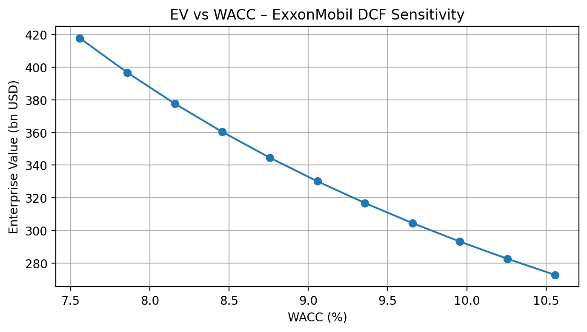
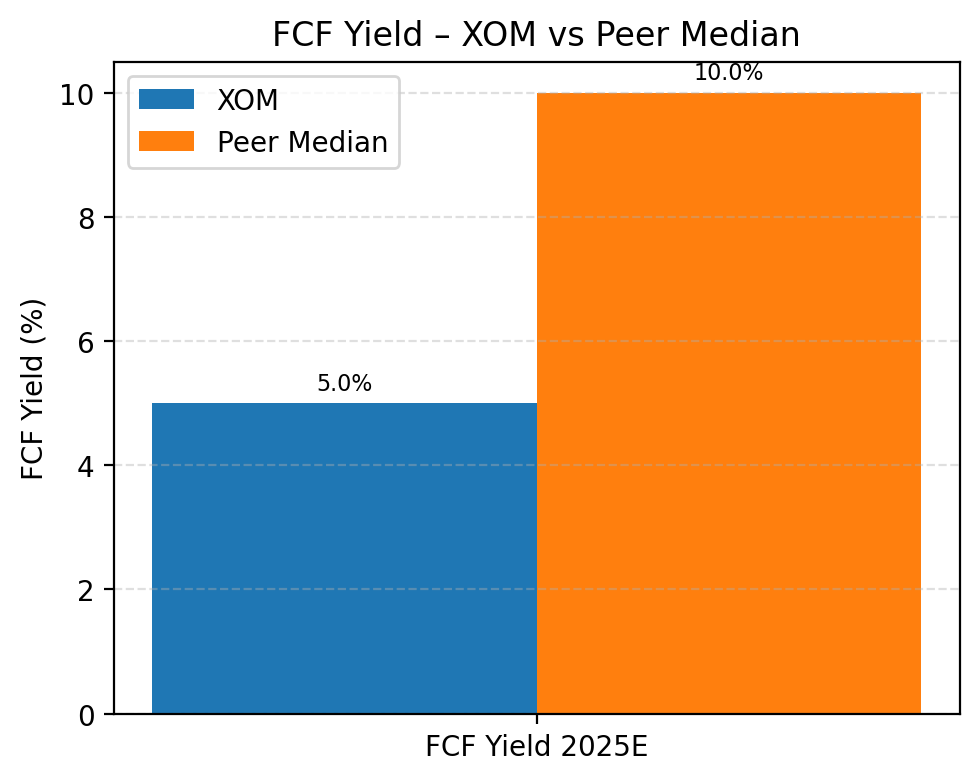

# ExxonMobil (XOM) - Analyst Summary (Stage 9)

**As of:** December 2025  
**Universe:** Integrated Oil & Gas  
**Methodologies:** DCF (intrinsic), Trading Comps (relative), Precedents (range framing), Infrastructure-style LBO (sponsor lens)

---

## Valuation Summary (auto-generated)

- **WACC:** **9.06%**
- **Terminal growth:** **2.00%**
- **Enterprise Value (EV):** **$330.1bn**
- **Net debt:** **$28.2bn**
- **Equity value:** **$301.9bn**
- **Shares outstanding:** **4.285bn**
- **Implied value per share:** **$70.45**
- **Spot price:** **$115.98**
- **Mispricing:** **+65% (overvalued)**

---

## Figures

  
  
  

